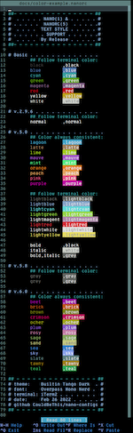
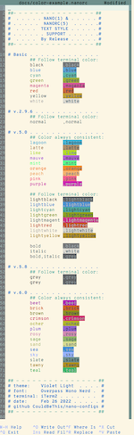
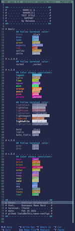

# in what version of `nano` various text styles & colors are possible

## about terminal colors

There are two categories of colors in `nano`: those which follow the color scheme (a.k.a theme, a.k.a palette) set by your terminal emulator, and those which are hardcoded to show up exactly the same no matter what. 

The former are basically the same as the [chart on ANSI escape codes wikipedia page](https://en.wikipedia.org/wiki/ANSI_escape_code#3-bit_and_4-bit); these can be modified by the terminal emulator or by other means to change the feel of the terminal. Therefor if you use these colors, they should blend in well with whatever color scheme the user prefers. 

On the other hand, the fancier hardcoded ones do not behave this way. They are always the same. It's a little more risk to use these colors, especially to mix the two groups in situations where contrast is required (text and background) because it cannot be assured. 

At the bottom of the page are some links if you are interested in terminal colors. 

If someone wants to write something smarter and more accurate here, you are more than welcome. 

## Screenshots of all colors available

you can obtain the sample document from the repository: [`color-example.nanorc`](color-example.nanorc). At some point in the suture the syntax highlighting may no longer work in the document because technically it shouldn't highlighting the second column after a tab. If/when that happen you can obtain the version of `nanorc.nanorc` used to create the demos [here](https://github.com/CouldBeThis/nanorc-syntax/blob/f9dbdb47d2bb70ef1210474c0e802ff94f99c6b6/nanorc.nanorc).

| Builtin Tango Dark iTerm2 theme                              | Violet Night iTerm2 theme                                    | Atelier Sulpherpool iTerm2 theme                             |
| ------------------------------------------------------------ | ------------------------------------------------------------ | ------------------------------------------------------------ |
|  |  |  |

## Details of what colors and styles are available in each release

### version 1.*x*

These colors will follow the native color scheme:

 * black
 * blue
 * cyan
 * green
 * magenta
 * red
 * yellow
 * white

[IMPROVEMENTS](https://nano-editor.org/dist/latest/IMPROVEMENTS) 

>  - [`1.2.0`:] Improvements to color syntax highlighting support: case insensitive matching, the ability to include color syntaxes in separate files, the ability to specify background colors without foreground colors...

### version 2.0

[IMPROVEMENTS](https://nano-editor.org/dist/latest/IMPROVEMENTS):

> Color syntax highlighting can be set by the first line of a file.

### version 2.90

[IMPROVEMENTS](https://nano-editor.org/dist/latest/IMPROVEMENTS)

>  - Addition of the color name "normal", meaning the default color.

### version 2.9.5

[NEWS](https://nano-editor.org/dist/latest/NEWS):

> 2018.03.29 - GNU nano **2.9.5** "Kiša pada" ...
>
> This version further adds a new color name, "normal", which gives the default foreground or background color, which is useful when you want to undo some overzealous painting by earlier syntax regexes.

### v.2.9.6

These colors will follow the native color scheme:

 * normal

### v.5.0

Color always consistent:

 * lagoon
 * latte
 * lime
 * mauve
 * mint
 * orange
 * peach
 * pink
 * purple

These colors will follow the native color scheme:

 * lightblack

 * lightblue

 * lightcyan

 * lightgreen

 * lightmagenta

 * lightred

 * lightwhite

 * lightyellow

 * black
 * white
 * **bold**, *italic*, and ***bold,italic***

2020.07.29 - GNU nano 5.0 "Among the fields of barley"...

[NEWS](https://nano-editor.org/dist/latest/NEWS):

> * On terminals that support at least 256 colors, nine new color names are available: pink, purple, mauve, lagoon, mint, lime, peach, orange, and latte.  These do not have lighter versions.
> * For the color names red, green, blue, yellow, cyan, magenta, white, and black, the prefix 'light' gives a brighter color. Prefix 'bright' is deprecated, as it means both bold AND light.
> * All color names can be preceded with "bold," and/or "italic," (in that order) to get a bold and/or italic typeface.

### v.5.8

These colors will follow the native color scheme:

 * gray
 * grey

[NEWS](https://nano-editor.org/dist/latest/NEWS):

> * Color name "grey" or "gray" can be used instead of "lightblack".

### v.6.0

Color always consistent:

 * beet
 * brick
 * brown
 * crimson
 * ocher
 * plum
 * rosy
 * sage
 * sand
 * sea
 * sky
 * slate
 * tawny
 * teal

[IMPROVEMENTS](https://nano-editor.org/dist/latest/IMPROVEMENTS)

>  - Colors can be given also in #rgb hexadecimal, to select the nearest color
>    from the 6x6x6 color-cube palette available on 256-color terminals.

[NEWS](https://nano-editor.org/dist/latest/NEWS):

> * For users who dislike numbers, there are fourteen new color names: rosy, beet, plum, sea, sky, slate, teal, sage, brown, ocher, sand, tawny, brick, and crimson.

## resources

- [terminal.sexy - Terminal Color Scheme Designer](https://terminal.sexy/) (:octocat: [stayradiated/terminal.sexy](https://github.com/stayradiated/terminal.sexy)- create and convert to and from many common formats in this web-app; has preview
- [Terminal Colors | Chris Yeh](https://chrisyeh96.github.io/2020/03/28/terminal-colors.html) - some technical information about the way colors work in terminals
- [thefryscorer/schemer2](https://github.com/thefryscorer/schemer2) - Terminal Colorscheme Generator and Converter
- [adi1090x/kitty-cat](https://github.com/adi1090x/kitty-cat) - Simple script to change color-schemes and fonts for kitty terminal only
- [Gogh - Color Scheme](https://mayccoll.github.io/Gogh/) ( [Mayccoll/Gogh](https://github.com/Mayccoll/Gogh)) - huge collection of schemes converted for use in various emulators
- [mbadolato/iTerm2-Color-Schemes](https://github.com/mbadolato/iTerm2-Color-Schemes) - another large collection of schemes that have been converted to suit a variety of emulators
- ⭐ [`theme.sh`](https://github.com/lemnos/theme.sh) - script that will change themes; cross platform and cross emulator so it is my personal favorite; comes bundled with lots of themes and can read various formats so it's easy to add new ones

